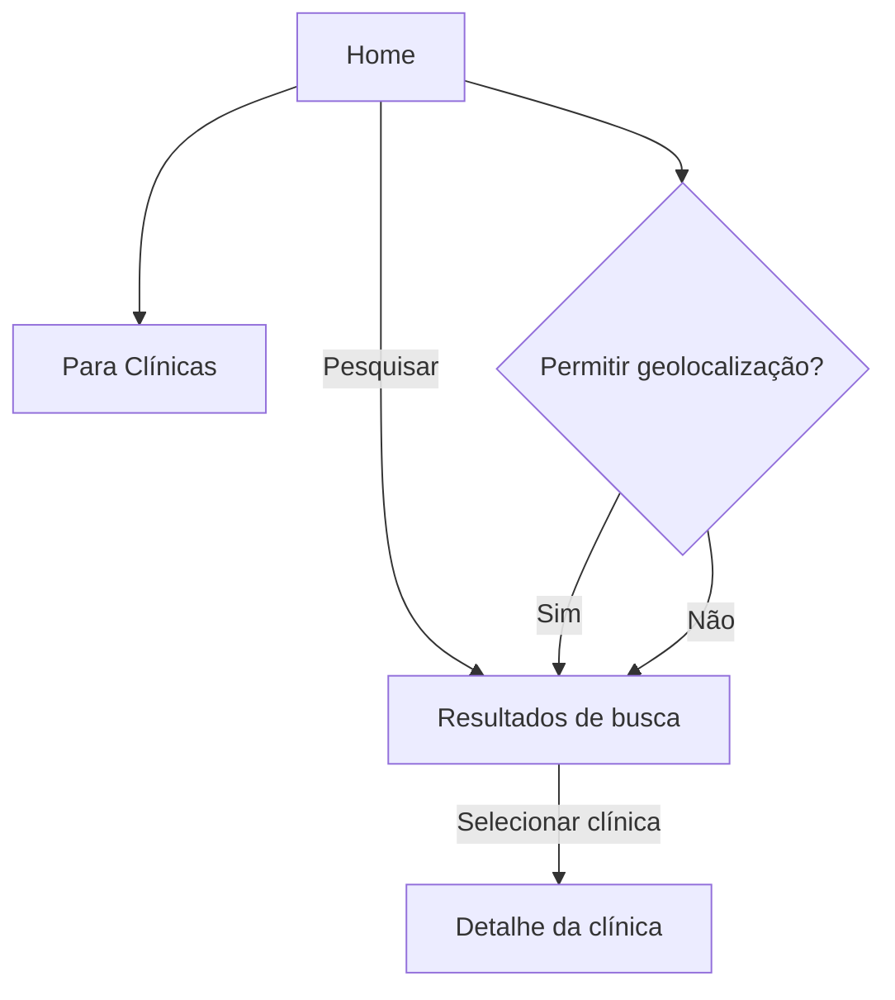

## Guia de funcionalidades para QA — VittaHub

Este documento descreve como a aplicação funciona do ponto de vista de uso e validação. Serve como referência para QA planejar e executar testes funcionais, de usabilidade e regressão.

### Visão geral

- **Stack**: React (SPA) + Vite + React Router.
- **Entrada**: `index.html` monta `#root` e carrega `src/main.jsx`.
- **Roteamento**: configurado em `src/App.jsx` com `BrowserRouter`.
- **UI**: componentes reutilizáveis em `src/ui/` (botões, inputs, cards, toast).
- **Dados**: lista de clínicas mockada em `src/constants/clinics.js`.
- **Geolocalização**: hook `src/hooks/useGeolocation.js` (opcional, depende de permissão do usuário).

### Região x GPS

- A Home prioriza a cidade selecionada pelo usuário (persistida em `localStorage` como `selectedLocation`).
- Se não existir cidade selecionada, utiliza o GPS (quando disponível) para compor "Clínicas mais bem avaliadas perto de você".
- Ao trocar a cidade no `SearchBar`, a seção de clínicas perto de você atualiza sem recarregar a página e a preferência é mantida ao navegar.

### Estrutura de telas (páginas)

- **HomePage (`src/pages/HomePage.jsx`)**

  - Exibe a marca, navegação principal e seções de destaque (`FeaturedSection`).
  - Campo de busca (`SearchBar`) para pesquisar clínicas.
  - Pode exibir carrosséis/grades de clínicas em destaque (`ClinicCarousel`, `ClinicCard`).

- **SearchResultsPage (`src/pages/SearchResultsPage.jsx`)**

  - Lista de resultados baseada no termo digitado na busca.
  - Cada item é um `ClinicCard` com informações resumidas e ação para abrir o detalhe.
  - Estado vazio quando não há resultados para o termo.

- **ClinicPage (`src/pages/ClinicPage.jsx`)**

  - Detalhes de uma clínica. Conteúdo carregado a partir do ID da rota e da lista em `constants/clinics.js`.
  - Coluna esquerda fixa (sticky) com card de clínica e CTA "Agendar consulta".
  - Botão do card abre `AppointmentModal` sem especialista selecionado.
  - Clique em profissional abre `AppointmentModal` já com o especialista setado (card refinado no modal).
  - Estado de “não encontrado” quando o ID não existe na lista.

- **ForClinicsPage (`src/pages/ForClinicsPage.jsx`)**

  - Página institucional para clínicas (informações/CTA).

- **Layout compartilhado**
  - `Navbar` e `Footer` presentes nas principais páginas.
  - `Toaster` para notificações (toasts) globais.

### Componentes centrais

- **Navbar (`src/components/Navbar.jsx`)**: navegação principal entre páginas.
- **SearchBar (`src/components/SearchBar.jsx`)**: input de texto; a submissão (Enter ou botão) navega à página de resultados.
  - Recebe `initialLocation` e emite `onLocationChange` sempre que o usuário altera a cidade.
- **ClinicCard (`src/components/ClinicCard.jsx`)**: cartão de clínica (nome, informações-chave, ação de ver detalhes).
- **ClinicCarousel (`src/components/ClinicCarousel.jsx`)**: carrossel de clínicas em destaque (quando presente).
- **FeaturedSection (`src/components/FeaturedSection.jsx`)**: seção com destaques/benefícios.
- **Footer (`src/components/Footer.jsx`)**: links institucionais e créditos.
- **AppointmentModal (`src/components/AppointmentModal.jsx`)**: fluxo de agendamento multi-etapas.

### Dados e comportamento

- **Fonte de dados**: `src/constants/clinics.js` contém uma lista estática de clínicas usada para renderização, busca e detalhe.
- **Busca**: filtra a lista de `clinics` de acordo com o termo. Deve ser tolerante a caixa (case-insensitive) e espaços extras. A aplicação pode aplicar regras adicionais (e.g., acentos), conforme implementado em `src/utils/utils.js` (se usado no filtro).
- **Geolocalização**: `src/hooks/useGeolocation.js` solicita permissão do navegador. Quando o usuário permite, as coordenadas podem ser usadas para ordenar/sugerir clínicas por proximidade nas telas que suportam esse recurso. Se negado, o app segue com comportamento padrão (sem proximidade).
- **Toasts**: `src/ui/toast.jsx`, `src/ui/toaster.jsx` e `src/ui/use-toast.js` mostram notificações (por exemplo, erros de permissão, mensagens informativas de busca vazia, etc.).

### Fluxos principais do usuário

1. **Descoberta na Home**

   - Usuário abre a Home → vê destaques → usa a busca para encontrar clínicas.

2. **Busca de clínicas**

   - Digita termo na `SearchBar` → submete → navega para resultados → vê lista de `ClinicCard`.
   - Se não houver itens, aparece estado vazio com orientação para ajustar o termo.

3. **Detalhe da clínica**

   - Na lista de resultados ou carrossel, clica em uma clínica → abre `ClinicPage` → vê informações detalhadas.
   - Se o ID da rota não for encontrado em `clinics`, exibe “não encontrado”.
   - Clicar em "Agendar consulta" (card da clínica) abre modal sem especialista.
   - Clicar em um profissional abre modal com especialista já selecionado.

4. **Geolocalização (opcional)**
   - Ao entrar no app ou na tela de resultados, a permissão pode ser solicitada.
   - Se aceita, as seções compatíveis podem usar proximidade; se negada, segue com ordem padrão.

### Diagrama de fluxo (alto nível)

### Responsividade e compatibilidade

- **CSS**: estilos em `src/styles/` e utilitários (ex.: Tailwind). Layout mobile-first com breakpoints usuais.
- **Navegadores**: Chrome/Edge/Firefox/Safari (versões recentes). Testar também WebView Android/iOS quando aplicável.

### Acessibilidade (a11y)

- Navegação por teclado (Tab/Shift+Tab) deve alcançar links, inputs e botões.
- Foco visível em elementos interativos.
- Imagens com `alt` significativo (quando informativas).
- Contraste adequado entre texto e fundo.

### Limitações conhecidas

- Lista de clínicas é mockada (sem integração com backend).
- Sem autenticação/login.
- Persistência de preferências limitada ao ciclo de vida da página (sem armazenamento remoto).

### Onde encontrar cada parte no repositório

- `src/main.jsx`: bootstrap do app e `BrowserRouter`.
- `src/App.jsx`: definição de rotas e layout global.
- `src/pages/*`: telas principais.
- `src/components/*`: componentes de UI específicos do domínio (Navbar, SearchBar, etc.).
- `src/ui/*`: componentes de UI genéricos (Button, Input, Card, Toast, etc.).
- `src/constants/clinics.js`: fonte de dados das clínicas.
- `src/hooks/useGeolocation.js`: permissão e leitura de coordenadas.
- `src/utils/utils.js`: utilitários (normalização de texto, etc., quando aplicável).

### Critérios gerais de aceite por funcionalidade

- **Busca**: submeter por Enter e por clique; tolerar caixa/espaços; mostrar estado vazio; navegar corretamente.
- **Resultados**: renderizar lista consistente; cada `ClinicCard` abre o detalhe; acessível por teclado.
- **Detalhe**: exibir dados corretos da clínica; tratar ID inválido; permitir navegação de retorno.
  - Coluna fixa (sticky) não deve sobrepor a navbar; offset adequado por breakpoint.
- **Geolocalização**: pedir permissão apenas quando necessário; tratar Negado/Erro sem travar a UI; não bloquear fluxo de busca.
- **Navegação**: links do `Navbar`/`Footer` funcionam; URL reflete a tela atual.
- **Toasts**: mensagens informativas/erro aparecem e desaparecem conforme esperado.
- **Responsividade**: layout íntegro em mobile, tablet e desktop.
